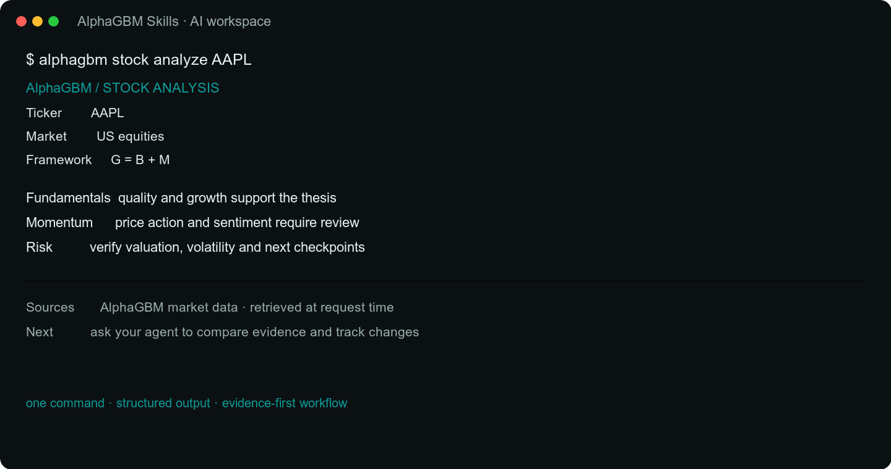

<div align="center">

# AlphaGBM Skills

**Bring AlphaGBM into your own AI workspace.**

*31 open skills for real-time market data, opportunity scoring, research and verification · Built for AI agents*

[](LICENSE) [](#skills-overview) [](https://github.com/AlphaGBM/skills)

[Website](https://alphagbm.com) · [Documentation](#skills-overview) · [Quick Start](#quick-start) · [Contributing](CONTRIBUTING.md)

See the [Skills v2 audit](docs/SKILLS_V2_AUDIT.md) for the current capability map and release gates.

---

<!-- TODO: Replace with actual screenshot of CLI/agent output -->


### 30-Second Demo

```bash
git clone https://github.com/AlphaGBM/skills.git .claude/skills/alphagbm
```

Then ask your AI: *"Show an AlphaGBM options demo using bundled sample data."*
Demo output is not live data. Use the API connection below for current results.

</div>

## What is AlphaGBM?

AlphaGBM is a **real-data market intelligence layer** for traders and AI agents. It connects live market data, quantitative scoring, research workflows and ongoing verification to the tools people already use.

These 31 skills bring AlphaGBM's capabilities into Claude Code, Cursor, Windsurf, Codex, WorkBuddy or any agent that supports skills.

### Why AlphaGBM?

| Capability | What the Skills provide |
|------------|-------------------------|
| Data access | Call AlphaGBM APIs from your AI workspace; distinguish live responses from bundled demos |
| Options intelligence | Scoring, volatility, Greeks and strategy workflows with endpoint-specific contracts |
| Stock research | Fundamental, sentiment and risk analysis; risk scores are not return probabilities |
| Published research | Read articles and preserve source links, publication times and evidence when provided |
| Shared account | Authenticated calls use the account behind your API key, not a separate Skills allowance |
| Investor frameworks | Optional research lenses, distinct from validated scoring models |

Market coverage, data freshness and API-key access vary by endpoint. Private
Research Brain and newer multi-asset workflows remain under contract review;
their presence in the product is not a blanket API-access guarantee.

## Quick Start

### Install as Claude Code Skills

```bash
# Clone into your project
git clone https://github.com/AlphaGBM/skills.git .claude/skills/alphagbm

# Or add as submodule
git submodule add https://github.com/AlphaGBM/skills.git .claude/skills/alphagbm
```

### Install for Cursor

```bash
git clone https://github.com/AlphaGBM/skills.git .cursor/skills/alphagbm
```

### Install CLI

```bash
# Clone and install
git clone https://github.com/AlphaGBM/skills.git
cd skills/cli
pip install -e .

# Set your API key
alphagbm config set-key agbm_xxxxxxxxxxxxxxxx

# Start analyzing
alphagbm stock analyze AAPL
alphagbm options score NVDA
```

See [cli/README.md](cli/README.md) for full CLI documentation.

### Try It (No API Key Needed)

Selected market tools include bundled samples for AAPL, NVDA, SPY, TSLA and META.
Explicitly request demo mode to use them; never present a stored sample as a
current quote. Research Insights uses published articles, not bundled samples.

> "Analyze AAPL stock using AlphaGBM"
> "Score NVDA options"
> "Show me TSLA's volatility surface"
> "What's the best bullish strategy for META?"

### Connect Live Data

```bash
# Set your API key for real-time data
export ALPHAGBM_API_KEY=agbm_xxxxxxxxxxxxxxxx
export ALPHAGBM_BASE_URL=https://alphagbm.zeabur.app  # optional, this is the default

# Get your free key at https://alphagbm.com/api-keys
```

### Check API Health

```bash
curl https://alphagbm.zeabur.app/api/health
```

Returns API status, available data fields, data source health, and market coverage — no auth needed. Useful for AI agents to verify what's available before making calls.

### Quota

Authenticated calls use the account associated with your API key; installing
a Skill does not create a separate allowance. Access, quota and cache behavior
depend on the endpoint and deployed environment. Consult your account for
current limits rather than assuming a cached call is free. Public Research
Insights reads do not require a key or start a paid analysis.

## Skills Overview

### Opportunity & Research (8 skills)

| Skill | What It Does | Example Query |
|-------|-------------|---------------|
| [**Stock Analysis**](skills/alphagbm-stock-analysis/) | G=B+M model: fundamentals, momentum, EV, risk score, AI report | "Analyze AAPL" |
| [**Options Score**](skills/alphagbm-options-score/) | Score 0-100 across 4 strategies (Sell Put/Call, Buy Put/Call) | "Best NVDA call to buy" |
| [**Options Strategy**](skills/alphagbm-options-strategy/) | Strategy builder + scanner with 15+ templates | "Bullish play on TSLA" |
| [**Vol Surface**](skills/alphagbm-vol-surface/) | 3D implied volatility across strikes & expiries | "Is AAPL IV expensive?" |
| [**Vol Smile**](skills/alphagbm-vol-smile/) | Skew analysis for a single expiration | "NVDA put skew" |
| [**Greeks**](skills/alphagbm-greeks/) | Greeks calculator + implied volatility solver | "Greeks for AAPL 220C" |
| [**P&L Simulator**](skills/alphagbm-pnl-simulator/) | What-if analysis for any position | "Simulate my iron condor" |
| [**Chokepoint Analysis**](skills/alphagbm-chokepoint/) | Map supply-chain bottlenecks and test concentration, irreplaceability and demand tension | "Find AI supply-chain chokepoints" |

### Data Intelligence (6 skills)

| Skill | What It Does | Example Query |
|-------|-------------|---------------|
| [**IV Rank**](skills/alphagbm-iv-rank/) | IV percentile vs. 252-day history | "Is TSLA IV high?" |
| [**Earnings IV Panel**](skills/alphagbm-earnings-crush/) | Crush history + implied move + IV Rank tag + priced Iron Condor | "Iron Condor for META earnings" |
| [**Unusual Activity**](skills/alphagbm-unusual-activity/) | Smart money / large block detection | "Unusual options flow today" |
| [**Market Sentiment**](skills/alphagbm-market-sentiment/) | VIX, Put/Call, Fear & Greed dashboard | "Market sentiment now" |
| [**VIX Status**](skills/alphagbm-vix-status/) ✨ | 5-tier fear thermometer: calm / normal / seller sweet spot / caution / extreme fear | "Is this a good time for BPS?" |
| [**FearScore**](skills/alphagbm-fear-score/) ✨ | Per-ticker 6-indicator panic composite; ≥60 is BPS entry signal | "Fear score QQQ", "is NVDA oversold" |

### Workflow Tools (4 skills)

| Skill | What It Does | Example Query |
|-------|-------------|---------------|
| [**Compare**](skills/alphagbm-compare/) | Side-by-side stock & options comparison | "AAPL vs MSFT" |
| [**Watchlist**](skills/alphagbm-watchlist/) | Monitor tickers for key changes | "Add NVDA to watchlist" |
| [**Alert**](skills/alphagbm-alert/) | Set IV, price, or activity alerts | "Alert if TSLA IV > 80" |
| [**Polymarket**](skills/alphagbm-polymarket/) | Prediction market vs. options pricing | "Rate cut odds vs options" |

### Risk & Portfolio Discipline (3 skills) ✨

Exit, hedge, and sizing decisions quantified from real data — not opinion.

| Skill | What It Does | Example Query |
|-------|-------------|---------------|
| [**Hedge Advisor**](skills/alphagbm-hedge-advisor/) ✨ | Scenario-driven hedge for an existing position (Falling Knife / Bottom Fishing / Gain Protection); returns priced Long Put / Collar / Tier-down specs | "Hedge my AAPL at cost 140, now 180" |
| [**BPS Backtest**](skills/alphagbm-bps-backtest/) ✨ | Walk-forward backtest of Bull Put Spread with signal vs no-signal control in one call | "Backtest BPS on QQQ — does FearScore work?" |
| [**Take-Profit Lab**](skills/alphagbm-take-profit/) ✨ | Any-ticker 15-strategy exit backtest; auto-classifies whether it's holdable or needs tiered exit via a novel "rollercoaster rate" metric | "Should I hold TQQQ long-term?" |

### Investor Masters (4 skills) 🎓

Mechanical translations of specific investors' philosophies into one-call tools.

| Skill | What It Does | Example Query |
|-------|-------------|---------------|
| [**Duan-Yongping Analysis**](skills/alphagbm-duan-analysis/) | Three-panel seller playbook (Sell Put at willing-buy price / Covered Call yield / VIX-tier panic-buy context) | "Duan-style analysis on AAPL" |
| [**Buffett Analysis**](skills/alphagbm-buffett-analysis/) ✨ | 4-lens scorecard (business / moat / management / valuation) → weighted HOLDABLE / WATCHABLE / AVOID verdict for any ticker | "Buffett analysis on KO" |
| [**Marks Cycle**](skills/alphagbm-marks-cycle/) ✨ | Howard Marks-style cycle position 0-100 blending VIX + IV Rank + P/C + valuation; maps to offense/defense posture. Free, no auth | "Where are we in the cycle?" |
| [**Tepper Signal**](skills/alphagbm-tepper-signal/) ✨ | Quantified Tepper 2009/2020 panic-buy detector: VIX ≥ 35 + FearScore ≥ 80 + quality filter → armed/watch/near/cold | "Is this a Tepper buy signal?" |

### Research & Knowledge (6 skills)

Build a personal, monitored research workspace. Profiles auto-refresh, theses get checked against triggers, the system audits itself weekly.

| Skill | What It Does | Example Query |
|-------|-------------|---------------|
| [**Company Profile**](skills/alphagbm-company-profile/) | Auto-built research files: fundamentals, PE/PB band, red flags, event radar | "Add NVDA to my knowledge base" |
| [**Investment Thesis**](skills/alphagbm-investment-thesis/) | Buy reasons + structured sell triggers, monitored automatically | "Why did I buy AAPL?" |
| [**Macro View**](skills/alphagbm-macro-view/) | Track VIX / US10Y / DXY / gold with portfolio-aware impact analysis | "Track VIX and US10Y" |
| [**Theme Research**](skills/alphagbm-theme-research/) | Group tickers into themes (AI infra, HK dividend) + news keyword watching | "Create an AI infra theme" |
| [**Health Check**](skills/alphagbm-health-check/) | Weekly audit: stale profiles, thesis drift, orphan pages → 0-100 score | "Audit my research brain" |
| [**Research Insights**](skills/alphagbm-research-insights/) | Retrieve published AlphaGBM research with market, tag, date and source metadata | "Show the latest semiconductor research" |

### See Also

- **[Investment Masters](https://github.com/AlphaGBM/investment-masters)** -- 12 masters' methodologies (Buffett, Dalio, Soros, Marks, Liang Wenfeng, Raschke...) + 13F tracking

## Architecture

```
You / Your AI Agent
    |  (natural language)
+------------------------------------------------------+
|              AlphaGBM Skills (this repo)              |
|                                                       |
|  Stock    Options   Vol      Strategy   Greeks   ...  |
|  Analysis  Score   Surface   Builder    Dashboard     |
+-------------------------+-----------------------------+
                          |
               +----------+----------+
               v                     v
         Mock Data              AlphaGBM API
      (built-in, free)      (alphagbm.zeabur.app)
                             Real-time market data
                             IV/HV/VRP/Greeks/Skew
```

### How Skills Connect

Skills aren't isolated -- they reference each other to form a complete workflow:

```
Stock Analysis --> Options Score --> Options Strategy --> P&L Simulator
       |                |                    |
       v                v                    v
   Compare          Vol Surface           Greeks
                    Vol Smile
                    IV Rank --> Earnings Crush

Market Sentiment --> Unusual Activity --> Alert
                                          Watchlist

Polymarket --> Market Sentiment --> Options Strategy
```

## Data Coverage

| Market | Stocks | Options | Data Points |
|--------|--------|---------|-------------|
| US | 200+ | Full chains | IV/HV/VRP/Greeks/Skew/Surface |
| HK | 35+ | Full chains | IV/HV/VRP/Greeks |
| CN | 20+ ETFs | Full chains | IV/HV/VRP/Greeks |
| Commodities | Au/Ag/Cu/Al | Futures options | IV/Greeks/Delivery risk |

## Real Data, Not Guesswork

Illustrative metrics below are not current quotes. Preserve actual source,
timestamp and missing-data fields when interpreting API responses:

| Metric | Value | How It's Computed |
|--------|-------|-------------------|
| **IV** | 32.5% | Black-Scholes on actual bid/ask prices |
| **IV Rank** | 58 | Current IV vs. 252 trading days of history |
| **VRP** | +4.0% | `Implied Vol - Historical Vol` — measures option overpricing |
| **Option Score** | 80/100 | Weighted: premium yield + support/resistance + safety margin + trend + PoP + liquidity + time decay |
| **Stock Risk** | API value | `risk.score` describes risk, not an opportunity score or probability of profit |
| **Risk** | 4/10 | Additive: valuation +2, growth +2, liquidity +2, market +1.5, technical +1 |
| **EV** | +5.2% | `50% × 1w + 30% × 1m + 20% × 3m` expected value |

This is not *"based on my training data"* or *"I estimate with 85% confidence."*

This is math on market data.

## Example Workflow

> **You**: "Analyze AAPL, then find the best options play"

The agent chains skills automatically:

```
1. GET  /api/stock/quick-quote/AAPL          → $261.40 (-0.8%)
2. POST /api/stock/analyze-sync              → G=B+M score 7.0/10, EV +5.2%, BUY
   {"ticker": "AAPL", "style": "balanced"}     Risk 4/10, target $275, stop-loss $239

3. GET  /api/options/snapshot/AAPL           → IV 32.5%, IV Rank 58, VRP +4.0%
4. POST /api/options/chain-sync              → Sell Put scores: 80, 78, 75...
   {"symbol": "AAPL", "expiry_date": "..."}    Buy Call scores: 76, 74, 72...

5. POST /api/options/tools/strategy/build    → Bull Call Spread 265/280
   {"template_id": "bull_call_spread"}         Max profit $1085, max loss $415

6. POST /api/options/tools/simulate          → Breakeven $269.15, PoP 44.5%
   {"symbol": "AAPL", "legs": [...]}
```

> **You**: "Is that IV expensive?"

```
7. GET  /api/options/snapshot/AAPL           → IV Rank 58 (moderate)
8. GET  /api/options/tools/vol-surface/AAPL  → ATM IV in contango, earnings in 26d
```

All from real API calls. All verifiable.

## Roadmap

- [x] 31 Skill definitions; selected market tools include demo data
- [x] Claude Code & Cursor support
- [x] CLI tool (`pip install -e ./cli`)
- [ ] Real-time WebSocket feeds
- [ ] Community strategy sharing
- [ ] More markets (EU, JP, KR options)

## Contributing

See [CONTRIBUTING.md](CONTRIBUTING.md) for guidelines. We welcome:

- Bug reports & feature requests
- Skill improvements & new skill proposals
- Translations (currently EN + CN)
- Mock data for additional tickers

## License

MIT -- see [LICENSE](LICENSE).

## Links

- [alphagbm.com](https://alphagbm.com) -- Full platform with live data
- [API Documentation](https://alphagbm.com/docs)
- [Discord Community](https://discord.gg/alphagbm)
- [Twitter/X](https://x.com/alphagbm)

---

<div align="center">

**Built by the [AlphaGBM](https://alphagbm.com) team.**

*Real data. Real signals. Real edge.*

</div>
